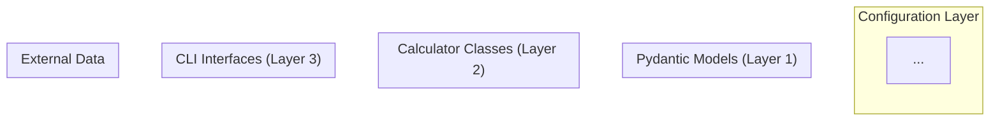

<objective>
Create the CLI interface, known-answer test suite, and architecture diagram for the SQQQ vs puts comparison tool.

Purpose: This completes the user-facing layer of Phase 8 (Layer 3 CLI), validates the calculator with known-answer tests (STD-04, HEDG-13, XC-04), creates the M2 architecture diagram (HEDG-11), and verifies the hedge_comparison_cli.py integration (part of HEDG-12). The CLI is the entry point for users and agents -- it must support --scenarios, --output json, and --help with complete examples.

Output: CLI script, pytest test file with 10+ known-answer tests, Mermaid architecture diagram.
</objective>

<execution_context>
@./.claude/get-shit-done/workflows/execute-plan.md
@./.claude/get-shit-done/templates/summary.md
</execution_context>

<context>
@.planning/PROJECT.md
@.planning/ROADMAP.md
@.planning/STATE.md
@.planning/phases/08-sqqq-vs-puts-comparison/08-RESEARCH.md
@.planning/phases/08-sqqq-vs-puts-comparison/08-01-SUMMARY.md

Reference files for CLI pattern:
@src/analysis/risk_metrics_cli.py
@src/analysis/options_cli.py

Reference files for test pattern:
@tests/python/test_itc_risk.py

Reference for existing architecture:
@src/CLAUDE.md
</context>

<tasks>

<task type="auto">
  <name>Task 1: Create hedge comparison CLI (Layer 3)</name>
  <files>src/analysis/hedge_comparison_cli.py</files>
  <action>
Create `src/analysis/hedge_comparison_cli.py` following the exact pattern of `src/analysis/risk_metrics_cli.py`:

**File structure:**
1. Shebang line: `#!/usr/bin/env python3`
2. Module docstring with:
   - Tool description: "SQQQ vs Protective Puts Hedge Comparison CLI for Finance Guru"
   - Architecture note: Layer 3 of 3-layer architecture
   - Agent usage examples (at least 4 examples)
   - Educational note about what the tool does
3. Imports: argparse, sys, json, Path, project_root path setup
4. Import from hedge_comparison: HedgeComparisonCalculator
5. Import from models: ComparisonOutput

**argparse arguments:**
- `--scenarios` (required): Comma-separated market drop percentages. Example: `-5,-10,-20,-40`. Parse by splitting on comma and dividing by 100 (so -5 becomes -0.05). Validate each is negative and > -100.
- `--days` (optional, default 30): Holding period in trading days.
- `--spot` (optional, default 480.0): Current QQQ spot price.
- `--strike` (optional, default None): Put strike price. If not specified, defaults to spot * 0.90 (10% OTM).
- `--premium` (optional, default 5.0): Put premium paid.
- `--sqqq-allocation` (optional, default 10000.0): Dollar amount allocated to SQQQ.
- `--baseline-iv` (optional, default 0.20): Current implied volatility.
- `--daily-vol` (optional, default 0.015): Expected daily QQQ volatility.
- `--output` (optional, choices=["human", "json"], default "human"): Output format.
- `--help` must show complete examples (use epilog with RawDescriptionHelpFormatter).

**Output formatting:**

Human-readable format (format_comparison_human function):
```
======================================================================
SQQQ vs PROTECTIVE PUTS - HEDGE COMPARISON
======================================================================

Parameters:
  QQQ Spot: $480.00 | Put Strike: $432.00 (10% OTM) | Premium: $5.00
  SQQQ Allocation: $10,000 | Holding Period: 30 days

Scenario         SQQQ Return   Naive -3x   Drag    Put P&L   Put P&L%   Winner
----------------------------------------------------------------------------------
-5% correction    +14.2%       +15.0%     0.8%    -$1.20    -24.0%     sqqq
-10% correction   +27.8%       +30.0%     2.2%    +$8.50    +170.0%    put
-20% bear market  +51.2%       +60.0%     8.8%    +$38.20   +764.0%    put
-40% crash        +85.6%       +120.0%   34.4%    +$42.10   +842.0%    put

Breakeven Analysis:
  SQQQ: Profitable when QQQ drops > 0.4% (covers fees + drag)
  Put:  Profitable when QQQ drops > 5.0% (covers premium)

======================================================================
DISCLAIMERS:
  * EDUCATIONAL ONLY. Not investment advice. Consult a licensed financial professional.
  * SQQQ decay is path-dependent. Results are approximate and vary with the price path taken.
  * IV expansion estimates use a simplified VIX-SPX regression model.
  * Past VIX-SPX relationships may not hold in future crises.
  * SQQQ simulation assumes perfect daily rebalancing.
======================================================================
```

JSON format: Use `result.model_dump_json(indent=2)` directly from the ComparisonOutput Pydantic model.

**main() function:**
1. Parse args
2. Parse --scenarios string: split by comma, convert to float / 100
3. Validate scenarios (all negative, all > -1.0)
4. Print status messages to stderr (following risk_metrics_cli.py pattern)
5. Create HedgeComparisonCalculator with constructor args from CLI flags
6. Call compare_all(scenarios)
7. Format output (human or json)
8. Print to stdout
9. Return 0 on success, 1 on error, 130 on KeyboardInterrupt

**Critical details:**
- Progress messages go to stderr (print(..., file=sys.stderr))
- Actual output goes to stdout (print(output))
- Educational disclaimer MUST appear in both human and JSON output
- Follow `if __name__ == "__main__": sys.exit(main())` pattern
  </action>
  <verify>
Run help: `uv run python src/analysis/hedge_comparison_cli.py --help`

Run comparison: `uv run python src/analysis/hedge_comparison_cli.py --scenarios -5,-10,-20,-40`

Run JSON output: `uv run python src/analysis/hedge_comparison_cli.py --scenarios -5,-10,-20,-40 --output json | python -m json.tool`

Run with custom parameters: `uv run python src/analysis/hedge_comparison_cli.py --scenarios -5,-10,-20,-40 --spot 500 --strike 450 --premium 8 --days 60`
  </verify>
  <done>CLI is runnable with `uv run python src/analysis/hedge_comparison_cli.py --scenarios -5,-10,-20,-40`. --help shows complete usage with examples. --output json produces valid parseable JSON. Human output includes comparison table with all scenarios, breakeven analysis, and disclaimers. All progress messages go to stderr, output to stdout.</done>
</task>

<task type="auto">
  <name>Task 2: Create known-answer tests for hedge comparison</name>
  <files>tests/python/test_hedge_comparison.py</files>
  <action>
Create `tests/python/test_hedge_comparison.py` following the pattern of `tests/python/test_itc_risk.py` (import structure, class-based test organization, descriptive test names, docstrings explaining what each test verifies).

**Import the calculator internals for direct testing:**
```python
from src.analysis.hedge_comparison import (
    HedgeComparisonCalculator,
    SQQQ_EXPENSE_RATIO,
    SQQQ_DAILY_FEE,
    SQQQ_LEVERAGE,
    VIX_SPX_TABLE,
    DEFAULT_DISCLAIMERS,
)
from src.models.hedge_comparison_inputs import (
    ScenarioInput, SQQQResult, PutResult, ComparisonRow, ComparisonOutput,
)
```

**Test classes (from research known-answer section + STD-04 requirement):**

**class TestSQQQSimulation:**

1. `test_constant_daily_return()` -- With constant daily QQQ return of -1%, SQQQ result is analytically deterministic. Calculate expected: `initial * (1 + (-3)*(-0.01) - SQQQ_DAILY_FEE)^10`. Assert within $0.01 (sub-penny accuracy).

2. `test_flat_market_loses_to_fees()` -- 252 days of 0% daily returns. SQQQ should lose approximately SQQQ_EXPENSE_RATIO (0.95%) over a year. Assert actual_loss within $5 of `initial * SQQQ_EXPENSE_RATIO`.

3. `test_volatile_flat_market_has_drag()` -- Alternating +2%, -2% daily returns for 20 days. QQQ is ~flat, but SQQQ should lose at least 2% due to volatility drag. Assert sqqq_return < -0.02 and > -0.10.

4. `test_sqqq_cannot_go_negative()` -- Feed a single +40% daily QQQ return (impossible but tests the zero floor). Assert final value >= 0.

5. `test_sqqq_returns_differ_from_naive_3x()` -- For -20% drop, simulated SQQQ return must differ from naive -3x (+60%) return. The naive_3x_return_pct and sqqq_return_pct must diverge by more than 0.1%.

6. `test_small_drop_sqqq_profitable()` -- For a -5% QQQ drop, SQQQ should have a positive return (proves the basic inverse leverage works).

**class TestPutPayoff:**

7. `test_deep_itm_put_profitable()` -- spot=100, strike=100 (ATM), premium=3, drop=-20%. Intrinsic should be ~$20. put_value > $20 (IV expansion adds time value). pnl > 0.

8. `test_otm_put_no_drop_loses_premium()` -- spot=100, strike=90 (10% OTM), premium=2, drop=0%. Intrinsic = 0. pnl < 0 (loses premium).

9. `test_iv_expansion_increases_put_value()` -- Two put calculations at same strike/spot: one at -5% drop, one at -20% drop. The -20% should have higher IV (from VIX-SPX regression). Verify iv_after is larger at -20% than at -5%.

**class TestBreakeven:**

10. `test_put_breakeven_atm()` -- ATM put: spot=100, strike=100, premium=5. Breakeven drop should be approximately -5% (spot falls to 95). Assert within 0.1%.

11. `test_sqqq_breakeven_is_small_drop()` -- SQQQ breakeven should be a very small negative number (just enough to cover fees/drag). Assert it is between -0.001 and -0.05.

**class TestComparisonOutput:**

12. `test_compare_all_returns_correct_scenario_count()` -- compare_all([-0.05, -0.10, -0.20, -0.40]) should return exactly 4 ComparisonRow objects.

13. `test_disclaimers_present()` -- Output must contain at least 3 disclaimers. At least one must contain "path-dependent" (HC-05).

14. `test_parameters_snapshot_present()` -- Output.parameters dict must not be empty and must contain "spot_price" key.

15. `test_winner_logic()` -- For -40% crash, put should NOT be winner if its PnL% is less than SQQQ return%. Verify the winner field makes logical sense (either sqqq, put, or neither).

**All tests must use `pytest.approx()` for floating point comparisons with appropriate tolerance.**

Do NOT mark any tests as `@pytest.mark.integration` -- all tests use pure calculation without network calls.
  </action>
  <verify>
Run all tests: `uv run pytest tests/python/test_hedge_comparison.py -v`

Check test count: `uv run pytest tests/python/test_hedge_comparison.py --collect-only | tail -5`

Verify no network calls: `uv run pytest tests/python/test_hedge_comparison.py -v --timeout=10`
  </verify>
  <done>All 15 tests pass. Tests cover SQQQ simulation (constant return, flat market, volatile drag, zero floor, naive-3x divergence), put payoff (deep ITM, OTM loss, IV expansion), breakeven (ATM put, small SQQQ breakeven), and comparison output (scenario count, disclaimers with path-dependent HC-05, parameters snapshot, winner logic). Zero network calls required.</done>
</task>

<task type="auto">
  <name>Task 3: Create M2 architecture diagram and verify integration</name>
  <files>docs/architecture/m2-hedging-components.mmd</files>
  <action>
**Part A: Create architecture diagram (HEDG-11)**

Create directory `docs/architecture/` if it does not exist.

Create `docs/architecture/m2-hedging-components.mmd` -- a Mermaid flowchart diagram showing all M2 Hedging milestone components and their data flow.

The diagram must show:

1. **Config layer**: user-profile.yaml -> config_loader.py -> HedgeConfig
2. **Models layer**: hedging_inputs.py, total_return_inputs.py, hedge_comparison_inputs.py
3. **Calculator layer**: TotalReturnCalculator, RollingTracker, HedgeSizer, HedgeComparisonCalculator
4. **Shared dependency**: OptionsCalculator (reused by HedgeComparisonCalculator)
5. **CLI layer**: total_return_cli.py, rolling_tracker_cli.py, hedge_sizer_cli.py, hedge_comparison_cli.py
6. **Data sources**: yfinance (market data), VIX-SPX regression table
7. **Output**: Human-readable text, JSON output
8. **Private data**: positions.yaml, roll-history.yaml, budget-tracker.yaml

Use `flowchart TD` (top-down) layout. Group related components in subgraphs.

Example structure:


Keep the diagram clear and readable -- no more than ~30 nodes. Use descriptive labels on edges for data flow (e.g., "daily returns", "BlackScholesInput", "ComparisonOutput").

Note: Phases 5, 6, and 7 components may not exist yet in the codebase. The diagram shows the PLANNED M2 architecture. Label non-existent components with "(Phase N)" annotations.

**Part B: Integration verification (HEDG-12 partial)**

After creating the diagram, verify that `hedge_comparison_cli.py --help` works:
```bash
uv run python src/analysis/hedge_comparison_cli.py --help
```

The full HEDG-12 requirement (all 4 CLIs) depends on Phases 6 and 7. For Phase 8, only verify hedge_comparison_cli works. Add a comment in the test file noting that full HEDG-12 integration requires all 4 phases complete.
  </action>
  <verify>
Diagram exists: `ls docs/architecture/m2-hedging-components.mmd`

Diagram has content: `wc -l docs/architecture/m2-hedging-components.mmd` (should be 30+ lines)

Diagram contains key components: `grep -c "HedgeComparisonCalculator\|OptionsCalculator\|hedge_comparison_cli" docs/architecture/m2-hedging-components.mmd` (should be >= 3)

Integration check: `uv run python src/analysis/hedge_comparison_cli.py --help` (exit code 0)
  </verify>
  <done>Architecture diagram exists at docs/architecture/m2-hedging-components.mmd showing all M2 components across 4 layers (config, models, calculators, CLIs) with data flow edges. hedge_comparison_cli.py --help returns exit code 0. HEDG-12 partial verification complete (full cross-CLI test deferred to milestone completion).</done>
</task>

</tasks>

<verification>
1. CLI runs: `uv run python src/analysis/hedge_comparison_cli.py --scenarios -5,-10,-20,-40` produces readable comparison table
2. JSON output: `uv run python src/analysis/hedge_comparison_cli.py --scenarios -5,-10,-20,-40 --output json` is valid JSON
3. Help text: `uv run python src/analysis/hedge_comparison_cli.py --help` shows complete examples
4. All tests pass: `uv run pytest tests/python/test_hedge_comparison.py -v` -- 15 tests, 0 failures
5. Architecture diagram: `docs/architecture/m2-hedging-components.mmd` exists with M2 component diagram
6. Educational disclaimers present in both human and JSON output (STD-02, XC-05)
7. --output json flag works (STD-01)
8. --help shows complete examples (STD-03)
9. Known-answer tests cover all calculators (STD-04)
</verification>

<success_criteria>
- `uv run python src/analysis/hedge_comparison_cli.py --scenarios -5,-10,-20,-40` exits 0 and shows comparison table
- `uv run python src/analysis/hedge_comparison_cli.py --output json --scenarios -5,-10,-20,-40 | python -m json.tool` validates as JSON
- `uv run pytest tests/python/test_hedge_comparison.py -v` passes all 15 tests
- `docs/architecture/m2-hedging-components.mmd` exists and contains "HedgeComparisonCalculator"
- Output includes at least one disclaimer containing "path-dependent"
</success_criteria>

<output>
After completion, create `.planning/phases/08-sqqq-vs-puts-comparison/08-02-SUMMARY.md`
</output>
