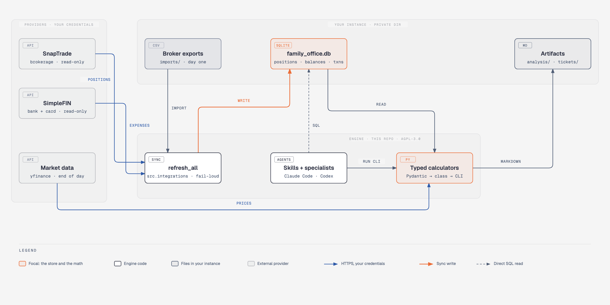

<div align="center">


# Finance Guru

### **Your brokerage account is not a spreadsheet problem. It is an operating system problem.**

_A self-hosted family office engine: typed Python calculators, a private SQLite ledger, and specialist agents that run inside Claude Code or Codex. Your data never leaves your machine unless you point it somewhere._


[](https://github.com/AojdevStudio/Finance-Guru/actions/workflows/ci.yml)
[](https://github.com/AojdevStudio/Finance-Guru/actions/workflows/quality-gates.yml)
[](pyproject.toml)
[](LICENSE)
[](https://github.com/AojdevStudio/Finance-Guru/stargazers)

[**Quick Start**](#quick-start) · [**How it works**](#how-it-works) · [**Docs**](https://aojdevstudio.github.io/Finance-Guru/) · [**For agents**](#if-you-are-an-agent)

</div>

One command, a full risk profile against live end-of-day data. No portfolio data required. Market analysis works from a fresh clone.

```bash
uv run python -m src.analysis.risk_metrics_cli TSLA --days 252 --benchmark SPY
```

## The split

You paste a screenshot into a chat model and ask whether a position is too big. The answer is plausible and unchecked. Chat models are excellent at deciding what question to ask and terrible at being the calculator. So split the job.

<div align="center">

### **Agents propose. Typed code computes.**
### **Guardrails fail closed, in Python, with tests.**

</div>

Every number an agent quotes comes from a Pydantic-validated calculator with a CLI you can run yourself. Every irreversible action passes through a guardrail that blocks when its inputs are missing rather than guessing. The AI gets judgment. The math gets a test suite.

<div align="center">

## **If a model can lie about it, a calculator owns it.**

</div>

## Quick start

### Prerequisites

Python 3.12 or later, [uv](https://docs.astral.sh/uv/), and Git. Bun only if you work on the SimpleFIN sync app.

### Install

```bash
git clone https://github.com/AojdevStudio/Finance-Guru.git
cd Finance-Guru
uv run python -m src.cli.instance_init ~/finance-guru-data --repo .
```

The instance is a small uv project outside the repo that depends on the engine. Private data lives there and nowhere else.

### Run

```bash
cd ~/finance-guru-data
uv run python -m src.integrations.refresh_all --show
uv run python -m src.analysis.risk_metrics_cli TSLA --days 252 --benchmark SPY
```

The first command prints your position, transaction, and expense tables (empty on a new instance). Drop broker CSV exports into `imports/` to work CSV-first, or wire up [live sync](docs/setup/live-sync-credentials.md) later.

### Install as a Claude Code plugin

```bash
claude plugin marketplace add AojdevStudio/Finance-Guru
claude plugin install finance-guru@finance-guru
```

Then run the `instance-onboarding` skill. It scaffolds the instance with `--plugin`, so the plugin is the single source of agents and skills and the checkout path's symlinks are skipped. The checkout path above remains the fully supported one.

## What is in the box

Finance Guru is the open-core engine behind Keepfolio, a "claude-code for personal finance." This repo is the free, self-hosted, CLI-native experience: the whole engine, every skill, every agent, no withheld tier.

| Component | What it does | Why it matters |
| :--- | :--- | :--- |
| **Typed calculators** (`src/`) | 20 CLIs for risk, momentum, volatility, correlation, optimization, backtesting, options, factors, hedging, total return, and margin metrics. Every one is Pydantic input, calculator class, CLI wrapper. | Calculations are testable outside any AI session. The suite is 1,100+ tests behind an 80% coverage gate. |
| **Private instance** | A directory outside the repo holding `family_office.db`, your `.env`, broker CSVs, and every artifact the engine writes. | No spreadsheet, no cloud sync, no vendor dashboard between you and your ledger. Tracked files never carry personal values. |
| **Sync layer** (`src/integrations/`) | `refresh_all` pulls SnapTrade (brokerage) and SimpleFIN (bank and card) into SQLite with your own read-only credentials. | Partial provider responses raise before any write. You get an error instead of a coverage ratio computed on half your accounts. |
| **Fail-closed guardrails** | Concentration cap, margin coverage, and ITC risk run against trusted inputs before a buy ticket persists. | A block on missing NAV, missing rate, or an unrun Layer 3 score. A bad ticket needs a number to pass, not a prompt to agree. |
| **Skills and specialists** (`.claude/`) | Skills and 11 specialist agents coordinated by a finance orchestrator. They read the DB, run the CLIs, and write Markdown into your instance. | Every output carries its data source, date stamp, and the educational-only disclaimer. You can trace any claim back to a CLI run. |
| **Compliance scan on push** | A pre-push hook scans history and the diff for secrets and PII. | The repo is public. Your data is not. The hook is what keeps that true. |



## How it works

### The guardrail loop

The buy-ticket pipeline is the clearest example of the split between judgment and arithmetic.


The model drafts a proposal. It has no say over the inputs that judge it. `GuardrailContext` carries the pre-borrow equity NAV, the configured annual margin rate, and the Layer 3 ITC score, and the checks run against those:

```python
CONCENTRATION_LIMIT = 0.30   # of pre-borrow equity NAV, never of a margin-inflated total
MIN_MARGIN_COVERAGE = 2.0    # dividend income over projected interest, new borrowing included
MAX_ITC_RISK = 0.7           # from Layer 3 output only; missing, not-run, or failed blocks
```

A block returns a typed reason (`equity_nav_unavailable`, `margin_rate_unavailable`, `coverage<2x`) and writes nothing. A pass persists the draft under a stable run id, then notifies. A failed notification is its own outcome, so a retry reuses the draft instead of writing a second one.

### The three-layer pattern

```text
src/analysis/risk_metrics.py        Pydantic input model + RiskCalculator
src/analysis/risk_metrics_cli.py    argparse wrapper, --output json, disclaimer
tests/python/test_risk_metrics.py   the math, tested without a network
```

Every tool in the engine follows this shape, so an agent can only ever call a CLI and quote its output. Nineteen of the twenty CLIs take `--output json`; margin metrics prints JSON by default. That is the contract the skills consume, so what an agent reports is exactly what the calculator returned. See the [CLI reference](docs/reference/api.md) for all 20.

```bash
uv run python -m src.analysis.risk_metrics_cli TSLA --days 252 --benchmark SPY --output json
```

### The private instance

The engine reads every private file from an instance directory outside the repository, resolved from `FIN_GURU_DATA_ROOT` or the current working directory. The instance holds `.env`, `user-profile.yaml`, `config.yaml`, `family_office.db`, `snaptrade-accounts.yaml`, and the working directories `imports/`, `analysis/`, `tickets/`, `strategies/`, `hedging/`, `reports/`, `auto-tickets/`, and `notes/`. Tracked files describe behaviour and never carry personal values. The full rule and its enforcement live in [DataClassification](.claude/skills/compliance-scan/references/DataClassification.md) and [PRIVACY.md](PRIVACY.md).

Local-first does not mean network-free. Market data, brokerage, and LLM integrations send request data to their configured providers. Configure only the integrations you intend to use.

## If you are an agent

You are the intended operator of this engine, not an afterthought. A few things that make you effective here:

- **Read `CLAUDE.md` first.** It is the single source of truth for the skills index, the agent roster, the path variables, and the output rules. `AGENTS.md` points Codex at the same tree through the instance's `.agents` symlink.
- **Run `date` before any market work.** Every specialist here is expected to know the current date before it searches or analyzes.
- **Never do the arithmetic yourself.** Call the CLI with `--output json` and quote what it returned. That is the whole reason the calculators exist.
- **Private data lives in the instance, not the repo.** Resolve `FIN_GURU_DATA_ROOT` or the working directory, read from `family_office.db`, and write artifacts into `analysis/` or `tickets/`. Tracked files never carry personal values, and the pre-push scan will stop you if you try.
- **Every financial output carries the educational-only disclaimer,** a date stamp, and its data source. The CLIs print it; the skills expect it.
- **Fail closed.** If a guardrail input is missing, the answer is a block with a typed reason. Do not fill the gap with an estimate.
- **Contributing a tool means all three layers.** Pydantic input model, calculator class, CLI wrapper, plus a test that runs without a network.

Skills in `.claude/skills/` are the workflows; specialists in `.claude/commands/fin-guru/agents/` are the personas; the finance orchestrator routes between them.

## Why this exists

Finance Guru started as one operator's answer to a personal constraint. Its author spent over a decade in pharmacy operations before teaching himself to build software, and along the way stopped using a checking account at all. Everything ran through a brokerage: paychecks in, margin as operating capital, dividends as the second income layer. No consumer finance app models that. They all assume a bank.

The stopgap was a chat model and a habit of pasting screenshots into it. Every answer was plausible. None of it was checked. The model did the arithmetic in its head, the positions lived in a CSV exported three weeks earlier, and the guardrail that should have stopped a bad ticket was a sentence in a prompt, not a line of code. Nothing was repeatable, so nothing was auditable.

> _"A fully autonomous, unbiased family office with agentic personalities grounded in math and truth, helping me achieve financial freedom."_
> The vision statement in [docs/VISION.md](docs/VISION.md), March 2026.

The first commits were agent personas and prompts. Persuasive, and unverifiable. The fix was not a better prompt. It was moving every calculation into typed Python with a CLI, so the agent's only move is to run the tool and read the answer. That split, judgment in the agent and arithmetic in code, is the whole architecture.

The second lesson came from sync. SimpleFIN can return HTTP 200 with a dropped account buried in an `errors` array, and the sync used to count that and move on. Now the rule is that anything financial fails loud or fails closed. Missing data blocks. Partial data raises. A guardrail without its inputs is a block, not a pass.

The repo is public because the pattern is more useful than the portfolio. The commercial macOS product, Keepfolio, is built on this engine. The engine stays free and complete.

<div align="center">

### The artifacts are the argument.

</div>

## Roadmap

- [x] Three-layer calculators for risk, momentum, volatility, correlation, optimization, backtesting, options, factors, hedging, and margin
- [x] Local SQLite system of record fed by SnapTrade and SimpleFIN
- [x] Fail-closed buy-ticket guardrails with Layer 3 ITC authority
- [x] Diátaxis documentation site on GitHub Pages
- [ ] Claude Code plugin as the primary install path ([#131](https://github.com/AojdevStudio/Finance-Guru/issues/131))
- [ ] Retirement-account sync migration gate ([#74](https://github.com/AojdevStudio/Finance-Guru/issues/74))
- [ ] Automated releases through release-please ([#112](https://github.com/AojdevStudio/Finance-Guru/issues/112))

Open items carry the `roadmap` label. Defects carry `bug`.

Recent changes are in the [changelog](CHANGELOG.md).

## Contributing

Read [Contributing](docs/CONTRIBUTING.md) first. It covers the accepted surfaces, the quality gates, and the privacy rules every push must pass. The required Python gates mirror CI:

```bash
uv sync --dev
uv run ruff format --check .
uv run ruff check .
uv run mypy src/
uv run pytest -m "not integration"
```

## Documentation

| Document | Purpose |
| --- | --- |
| [Documentation site](https://aojdevstudio.github.io/Finance-Guru/) | Tutorials, how-to guides, reference, and explanation |
| [Setup](docs/setup/SETUP.md) | Install the engine and create an instance |
| [CLI reference](docs/reference/api.md) | Commands, arguments, and output |
| [Live sync credentials](docs/setup/live-sync-credentials.md) | Bring-your-own-credentials setup for SnapTrade and SimpleFIN |
| [Runbooks](docs/runbooks/README.md) | Recurring portfolio and operations workflows |
| [Troubleshooting](docs/setup/TROUBLESHOOTING.md) | Common installation and runtime failures |

## Acknowledgments

Market data through [yfinance](https://github.com/ranaroussi/yfinance). Brokerage connectivity through [SnapTrade](https://snaptrade.com/). Bank and card connectivity through [SimpleFIN](https://www.simplefin.org/). Agent surfaces on [Claude Code](https://code.claude.com/) and [Codex](https://github.com/openai/codex). Diagrams drawn with the diagram-design skill; terminal recording with [vhs](https://github.com/charmbracelet/vhs).

## License

Finance Guru is licensed under the [GNU Affero General Public License v3.0](LICENSE).

## Financial disclaimer

Finance Guru is educational software, not investment advice. Financial markets involve risk, including possible loss of principal. Verify all data and calculations independently and consult appropriately licensed financial, tax, and legal professionals before acting.

---

<div align="center">

**Agents propose. Typed code computes.**

If the split between judgment and arithmetic is the thing you were missing, [star the repo](https://github.com/AojdevStudio/Finance-Guru).

</div>
