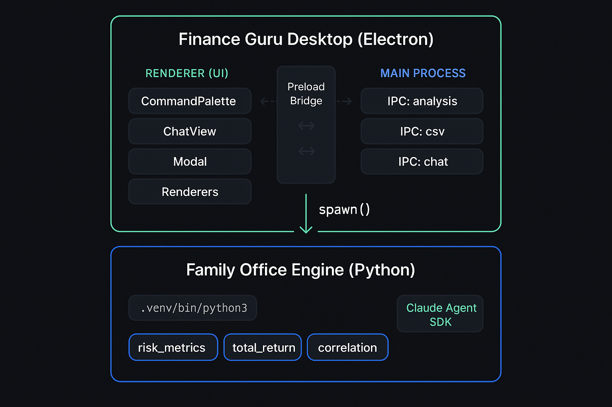

<div align="center">


<br />

# Finance Guru Desktop

**Stop typing CLI commands at 6am.**<br/>
**Start clicking buttons like you own a family office.**

<br/>


</div>

<br/>

---

## The Problem

You spent months building one of the most capable personal finance engines that exists on a single machine. Nine quantitative tools. Sharpe ratios, VaR at 95th and 99th, correlation matrices, options chains with Greeks, Monte Carlo simulations, backtesting with walk-forward validation. All production-grade. All running locally on your Mac.

And every time you want to check your TSLA risk exposure, you open a terminal and type:

```bash
uv run python src/analysis/risk_metrics_cli.py TSLA --days 252 --benchmark SPY --output json
```

Then you squint at a wall of JSON. Copy the Sharpe ratio. Open another tab. Run correlation. Copy that too. Paste into a note. Repeat.

> _You built an institutional engine and access it like it's 1997._

---

<div align="center">

### The Breakthrough

_A family office doesn't type commands._<br/>
_A family office has an **operations room**._

</div>

---

## The Solution

Finance Guru Desktop wraps the entire family-office Python engine in a native Electron GUI. No browser tabs. No Streamlit reloads. No terminal archaeology.

Every analysis tool you built? **It's a button now.**

<br/>

<div align="center">

</div>

<br/>

<details>
<summary><b>Architecture in plain text</b></summary>

```
┌────────────────────────────────────────────────────────┐
│              Finance Guru Desktop (Electron)            │
│                                                        │
│  ┌─────────────────┐       ┌─────────────────────────┐ │
│  │    Sidebar       │       │    Analysis Panel       │ │
│  │                  │       │                         │ │
│  │  📈 Total Return │──────►│  Plotly dark charts     │ │
│  │  📉 Risk Metrics │       │  Animated risk gauges   │ │
│  │  🔗 Correlation  │       │  Data tables            │ │
│  │  📊 Options Chain│       │  Compliance disclaimers │ │
│  │                  │       └─────────────────────────┘ │
│  │  ── Skills ──    │                                   │
│  │  Quant Analysis  │       ┌─────────────────────────┐ │
│  │  Strategize      │──────►│    Chat Panel           │ │
│  │                  │       │  Claude streaming +     │ │
│  │  ── Agents ──    │       │  Skills + Specialists   │ │
│  │  Orchestrator    │       └─────────────────────────┘ │
│  └─────────────────┘                                    │
└──────────────────────────────┬─────────────────────────┘
                               │ spawn()
                               ▼
            ┌────────────────────────────────────┐
            │     Family Office Engine (Python)   │
            │                                    │
            │  .venv/bin/python3                 │
            │  risk_metrics ─ correlation        │
            │  total_return ─ options_chain      │
            │  + 5 more tools (V2 roadmap)       │
            └────────────────────────────────────┘
```

</details>

---

## See It In Action

| Click this... | ...get this |
|:---:|:---:|
| **📈 Total Return** | Plotly bar chart: price return, dividend return, DRIP return |
| **📉 Risk Metrics** | Animated gauge bars: Sharpe, VaR, drawdown, beta, alpha |
| **🔗 Correlation** | Interactive heatmap: cross-asset correlation matrix |
| **📊 Options Chain** | Data table: strikes, OI, IV, Greeks |

> Click a tool → fill the form → watch the chart render. That's it.

---

## What Makes This Different

| Feature | Terminal CLI | Streamlit | **Finance Guru Desktop** |
|---------|:-----------:|:---------:|:------------------------:|
| Launch time | Instant (but ugly) | 3-5s cold start | **~1s** |
| Multiple tools | New terminal each | Separate pages | **Sidebar, one click** |
| Chart quality | None (JSON) | Basic | **Plotly dark theme** |
| Risk visualization | Numbers only | Static | **Animated gauges** |
| Chat with Claude | Separate app | N/A | **Built-in, streaming** |
| Security | Full shell access | Full shell access | **Allowlist + spawn()** |
| Runs locally | Yes | Yes | **Yes** |

---

## Quick Start

### Prerequisites

The family-office Python engine must be set up (it already is on your machine):

```bash
# Verify from the family-office root
ls .venv/bin/python3                                              # ✓ Exists
uv run python src/analysis/risk_metrics_cli.py AAPL --help        # ✓ Responds
```

### Install & Launch

```bash
cd finance-guru-desktop
bun install              # One time — installs Electron + deps
bun run start            # Builds renderer, opens the app
```

That's it. Two commands. The app uses your existing `.venv` — no Python packages to configure.

### Development

```bash
bun run start:dev        # App + DevTools open
bun run watch            # Auto-rebuild on save (use with `bunx electron .` in another tab)
bun run build:renderer   # One-off bundle to dist/renderer.bundle.js
bun test                 # 56 tests, 153 assertions
bun test --watch         # Watch mode
```

---

## How It Works

### File Structure

```
finance-guru-desktop/
├── main.js                         # Electron bootstrap, single instance, PATH fix
├── preload.js                      # Narrow IPC bridge (app / analysis / csv / chat)
├── renderer.js                     # UI entry → esbuild → dist/renderer.bundle.js
│
├── src/main/
│   ├── config/
│   │   ├── runtimePaths.js         # Single source of truth for all paths
│   │   └── validateRuntime.js      # Startup health check (Python, src/, Claude)
│   └── ipc/
│       ├── analysis.ipc.js         # Spawns Python CLIs from allowlist, 60s timeout
│       ├── csv.ipc.js              # Path-restricted CSV reader
│       ├── chat.ipc.js             # Agent SDK sessions + message queue
│       └── dialog.ipc.js           # Native file dialogs
│
├── src/renderer/
│   ├── commands/registry.js        # V1 command definitions + analysis allowlist
│   ├── state/portfolio.state.js    # Observable portfolio state
│   ├── utils/
│   │   ├── parseCsv.js             # RFC-compliant CSV parser (quoted fields)
│   │   └── plotlyTheme.js          # Dark theme via CSS variables
│   └── ui/
│       ├── CommandPalette.js        # Sidebar tool/skill/agent buttons
│       ├── ChatView.js              # Streaming markdown + tool call display
│       ├── Modal.js                 # Dynamic arg forms from command definitions
│       └── renderers/               # Chart, Gauge, Table, Heatmap renderers
│
├── styles/                          # 7 CSS modules (dark theme, #22c55e accent)
└── tests/                           # 56 tests across 6 suites
```

### Security Model

This isn't a web app with a thousand attack surfaces. It's a local desktop tool with a locked-down bridge:

| Layer | Protection |
|-------|-----------|
| **Analysis commands** | Allowlisted in `ALLOWED_ANALYSIS_COMMANDS` — 4 commands, no wildcards |
| **Process spawning** | Args passed as arrays to `spawn()` — shell injection structurally impossible |
| **CSV reads** | Restricted to `fin-guru-private/` and `notebooks/updates/` only |
| **IPC bridge** | Preload exposes named methods — no raw `ipcRenderer.send` access |
| **Chat auth** | Validates Claude credentials at startup — analysis works without auth |

### Chat & Agents

The Chat tab connects to Claude via `@anthropic-ai/claude-agent-sdk` with full streaming. Skills and Specialist agents from the sidebar command palette route into chat automatically.

If `ANTHROPIC_API_KEY` isn't set and `~/.claude/` credentials aren't found, the app shows a setup warning. Analysis and CSV tools remain fully functional — only chat is gated behind auth.

---

## The Story

Finance Guru started as a collection of Python scripts. Risk calculations for a real portfolio. Then it grew — backtesting, optimization, Monte Carlo simulations, dividend tracking, margin management. Nine production tools, 3-layer type safety, 100+ tests.

But every interaction was the same: open a terminal, type a command, read JSON.

The engine was built for institutional-grade analysis. The interface was built for someone who enjoys typing `--output json` at 6am. These two things were incompatible.

Finance Guru Desktop was built in a single session from a 19-task architectural plan. 37 files. 3,100 lines. 56 tests. Every tool maps 1:1 to a CLI that already works — the desktop app adds _zero_ artificial logic. It's a secure, tested window into an engine that was always powerful enough.

Your family office. Your data. Completely local. Now with buttons.

---

## Roadmap

| Phase | What | Status |
|-------|------|--------|
| **V1** | 4 analysis tools, CSV loading, Claude chat | ✅ Shipped |
| **V2** | Momentum, volatility, moving averages, backtester | Planned |
| **V3** | Portfolio optimizer, Monte Carlo, real-time tickers | Planned |
| **V4** | Multi-account dashboard, dividend tracker integration | Planned |

---

<div align="center">

<br/>

**Your family office. Your data. Your operations room.**

_Built for the Irondi household — not a product, a command center._

<br/>


</div>
